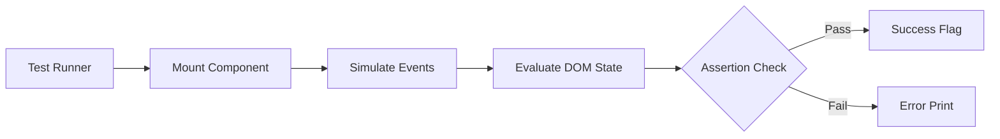

# Experiment 8: Testing and Quality Assurance

<div align="center">
  
  
  
</div>

## Project Overview

This repository contains the codebase for **Testing and Quality Assurance**, implemented as part of the College Experiment of Full Stack 2 curriculum. The objective of this experiment is to draft robust component tests, utilizing query mechanisms and simulation environments.

## Architecture & Data Flow



## Core Components

| Component | Responsibility | Technologies Used |
|-----------|----------------|-------------------|
| `Counter` | Unit isolated for UI rendering and internal state manipulation | React Component |
| `Test Block` | Code blocks documenting DOM target acquisition and assertions | Jest, Testing Library |
| `App.tsx` | Main exhibition layer that presents testing strategy interfaces | JSX |

## Key Features

- **Unit Isolation**: Ensuring components operate functionally in a vacuum.
- **Behavior Simulation**: Mimicking user interactions like `fireEvent.click()`.
- **Query Selection**: Resolving elements by specific identifiers.
- **Predictable Assertions**: Strictly checking state string modifications and expectations.

## Getting Started

### Prerequisites
- Node.js (v16 or higher)

### Installation
```bash
npm install
npm run dev
```


## Source Code (`App.tsx`)

```tsx
import { useState } from 'react';
import './App.css';

// Component to be tested
export const Counter = () => {
  const [count, setCount] = useState(0);
  return (
    <div className="counter-component">
      <h2 data-testid="count-display">Count: {count}</h2>
      <button onClick={() => setCount(c => c + 1)} data-testid="increment-btn">Increment</button>
      <button onClick={() => setCount(c => c - 1)} data-testid="decrement-btn">Decrement</button>
    </div>
  );
};

function App() {
  return (
    <div className="testing-lab">
      <h1>Experiment 7: Testing and QA</h1>
      <p>Implementation of testable components and unit test structures.</p>
      
      <div className="test-area">
        <h3>Component Under Test</h3>
        <Counter />
      </div>

      <div className="test-docs">
        <h3>Test Example (App.test.tsx)</h3>
        <pre>
{`import { render, screen, fireEvent } from '@testing-library/react';
import { Counter } from './App';

test('increments counter on button click', () => {
  render(<Counter />);
  const btn = screen.getByTestId('increment-btn');
  const display = screen.getByTestId('count-display');
  
  fireEvent.click(btn);
  expect(display.textContent).toBe('Count: 1');
});`}
        </pre>
      </div>
    </div>
  );
}

export default App;

```
